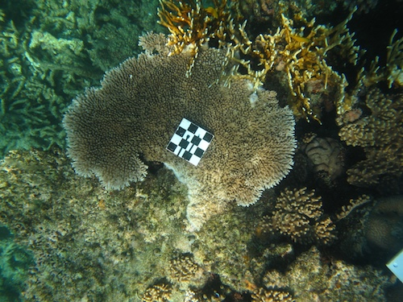
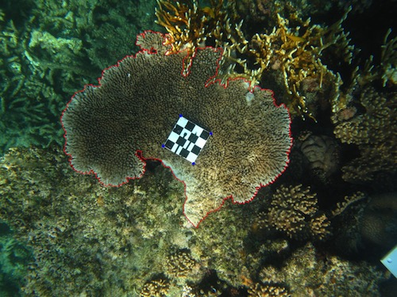

# Code for calculating area and perimeter from outlined coral images

The code requires the original image in which an object was outlined as well as three corresponding files:

1. The outline file (.ol), which contains the outline coordinates exported from ImageJ
2. The square file (.sq), which states how many scale plate squares were used in the landmark file
3. The landmark file (.lm), which has the corners of the area used from the scale plate, either 1, 4, 9 or 16. Always 16 when the full scale plate is visible in an image.

The code superimposes the outline and landmarks onto the image (saved in output) for visual confirmation of outlining accuracy, and generates a file with area and perimeter estimates

